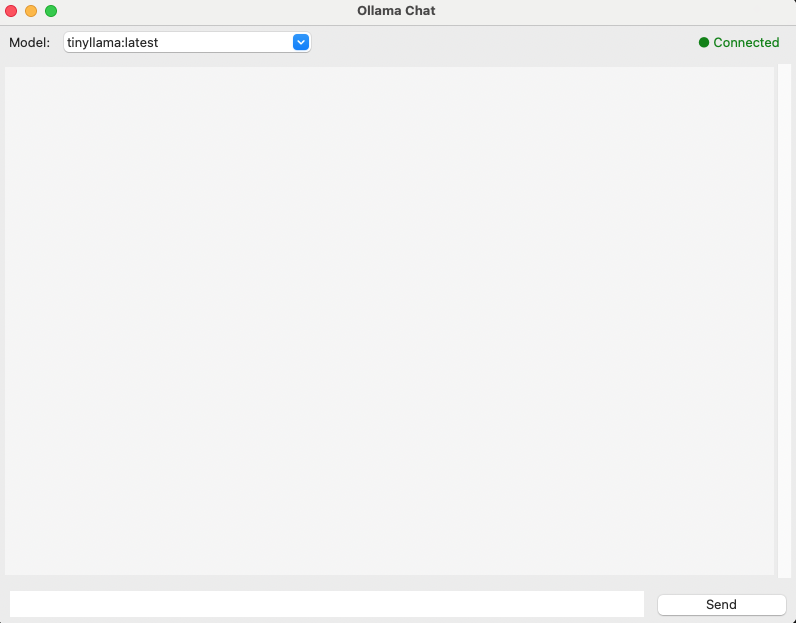
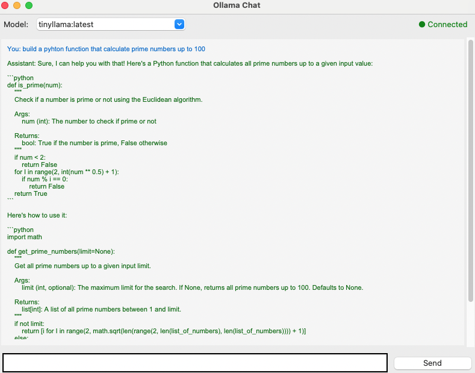

# Chat Application with Local LLM

A desktop chat application that interfaces with local LLM models via Ollama REST API (not web interface).

## Project Status

✅ **Complete** - A fully functional desktop chat application that interfaces with local LLM models via Ollama REST API (not web interface).

## API Connection

**Important:** This application connects to Ollama via **REST API** (HTTP requests), not via web interface.

- **API Endpoint:** `http://localhost:11434`
- **API Methods Used:**
  - `GET /api/tags` - List available models
  - `POST /api/chat` - Send messages and receive responses
- **Implementation:** Uses Python `requests` library for HTTP API calls
- **No Web Interface:** The application does not use Ollama's web UI; it communicates directly with the API

## Quick Start

### Prerequisites

- Python 3.8+ (Python 3.11 recommended)
- Ollama installed and running locally
- At least one Ollama model installed (e.g., `ollama pull tinyllama`)

### Installation Instructions

Follow these steps carefully to set up and run the project:

#### Step 1: Clone the Repository

```bash
git clone <repository-url>
cd ex1
```

Replace `<repository-url>` with the actual repository URL.

#### Step 2: Set Up Python Environment

You must use a virtual environment (venv or conda) as required. Choose one option:

**Option A: Using Conda (Recommended)**

```bash
# Create conda environment with Python 3.11
conda create -n ollama-chat python=3.11 -y

# Activate the environment
conda activate ollama-chat

# Verify Python version (should show 3.11.x)
python --version

# Install all required dependencies
pip install -r requirements.txt

# Verify installation
pip list | grep -E "(requests|pytest)"
```

**Option B: Using Python venv**

```bash
# Create virtual environment
python -m venv venv

# Activate the environment
# On macOS/Linux:
source venv/bin/activate
# On Windows:
venv\Scripts\activate

# Verify Python version
python --version

# Install all required dependencies
pip install -r requirements.txt

# Verify installation
pip list | grep -E "(requests|pytest)"
```

**Expected Result:** 
- Virtual environment is created and activated
- Python 3.8+ is available
- All packages from `requirements.txt` are installed (requests, pytest, pytest-cov)

#### Step 3: Install and Set Up Ollama

**3.1 Install Ollama:**

```bash
# On macOS (using Homebrew):
brew install ollama

# On Linux:
curl -fsSL https://ollama.com/install.sh | sh

# On Windows: 
# Download installer from https://ollama.ai/download
# Run the installer and follow the instructions
```

**Expected Result:** Ollama is installed. Verify with:
```bash
ollama --version
```

**3.2 Start Ollama Service:**

```bash
# Start Ollama service (runs in background)
ollama serve

# On macOS with Homebrew, Ollama starts automatically as a service
# You can check if it's running:
curl http://localhost:11434/api/tags
```

**Expected Result:** 
- Ollama service is running on `http://localhost:11434`
- API endpoint responds (returns JSON with models list, even if empty)

**3.3 Install a Model:**

```bash
# Pull the smallest model for testing (recommended - ~637MB)
ollama pull tinyllama

# Verify model is installed
ollama list

# Or pull other models:
ollama pull llama2      # ~3.8GB
ollama pull mistral     # ~4.1GB
```

**Expected Result:**
- Model is downloaded and installed
- `ollama list` shows the installed model(s)
- Model is ready to use

#### Step 4: Verify Setup

Before running the application, verify everything is set up correctly:

```bash
# Make sure environment is activated
conda activate ollama-chat  # or: source venv/bin/activate

# Verify Python can import required modules
python -c "import requests; import tkinter; print('All dependencies OK')"

# Verify Ollama is running
curl http://localhost:11434/api/tags

# Verify model is installed
ollama list
```

**Expected Result:**
- All Python dependencies are available
- Ollama API responds
- At least one model is installed

#### Step 5: Run the Application

```bash
# Make sure conda/venv environment is activated
conda activate ollama-chat  # or: source venv/bin/activate

# Run the application
python -m src.main

# Or alternatively:
python src/main.py
```

**Expected Result:**
- GUI window opens
- Application connects to Ollama
- Model dropdown shows available models
- Status indicator shows "Connected" (green)
- You can select a model and start chatting

#### Troubleshooting

**If the application doesn't start:**
1. Verify Python environment is activated: `which python` should show the venv/conda path
2. Verify dependencies are installed: `pip list | grep requests`
3. Verify Ollama is running: `curl http://localhost:11434/api/tags`
4. Check for error messages in the terminal

**If connection fails:**
1. Make sure Ollama service is running: `ollama serve`
2. Check if port 11434 is available: `lsof -i :11434`
3. Verify Ollama is installed: `ollama --version`

**If no models are available:**
1. Install a model: `ollama pull tinyllama`
2. Verify installation: `ollama list`
3. Restart the application

## Screenshots

Screenshots of the running application interface:

### Main Chat Window

*The main chat interface showing the application window with model selection dropdown and connection status indicator. The interface is ready for user input.*

### Chat Conversation

*Example conversation showing the user asking for a Python function to calculate prime numbers, and the assistant providing a detailed response with code examples. This demonstrates the application's ability to maintain conversation context and provide helpful responses.*

## Project Structure

```
ex1/
├── README.md                 # This file
├── PRD.md                    # Product Requirements Document
├── requirements.txt          # Python dependencies
├── src/                      # Source code
├── tests/                    # Unit tests
├── Documentation/            # Development documentation
└── screenshots/              # Application screenshots
```

## Unit Tests

### Running Tests

```bash
# Make sure environment is activated
conda activate ollama-chat  # or: source venv/bin/activate

# Run all tests
pytest tests/

# Run with verbose output
pytest tests/ -v

# Run specific test file
pytest tests/test_api.py
```

### Unit Tests with Expected Results

All unit tests include the expected result in their docstrings. Below are the unit tests and their expected results:

#### Test 1: `test_ollama_connection()`
**Expected Result:** Returns `True` if Ollama is running, `False` otherwise.
- If Ollama service is running: Returns `True` (boolean)
- If Ollama service is not running: Returns `False` (boolean)

#### Test 2: `test_list_models()`
**Expected Result:** Returns a list of strings containing model names.
- If Ollama is running and models are installed: Returns list of model names (e.g., `['tinyllama:latest']`)
- If Ollama is not running: Returns empty list `[]`
- Each element in the list is a string representing a model name

#### Test 3: `test_send_message()`
**Expected Result:** Returns a non-empty string response if model is available.
- If Ollama is running and model exists: Returns a non-empty string (the model's response)
- If Ollama is not running: Test is skipped with message "Ollama is not running"
- If no models are available: Test is skipped with message "No models available"
- If model doesn't exist: Raises `ConnectionError`

#### Test 4: `test_client_initialization()`
**Expected Result:** Client initializes with the provided base URL.
- Client object is created with custom base URL
- `client.base_url` equals the provided URL (e.g., `"http://localhost:11434"`)

#### Test 5: `test_conversation_history()`
**Expected Result:** Model maintains context from previous messages in conversation.
- First message is sent and receives a response (non-empty string)
- Conversation history is updated with user and assistant messages
- Second message is sent with conversation history
- Model receives the second message with context (returns non-empty string)
- If Ollama is not running: Test is skipped
- If no models available: Test is skipped

#### Test 6: `test_end_to_end_chat_flow()`
**Expected Result:** Completes full chat flow successfully.
- Connection check returns `True`
- Models can be listed (returns non-empty list)
- Messages can be sent and responses received (returns non-empty string)
- If Ollama is not running: Test is skipped

#### Test 7: `test_model_switching()`
**Expected Result:** Different models can be used to send messages.
- First model responds with a string
- Second model responds with a string
- Both responses are non-empty strings
- If less than 2 models available: Test is skipped

#### Test 8: `test_error_handling()`
**Expected Result:** Appropriate errors are raised for invalid model names.
- When invalid model name is used: Raises `ConnectionError` or `Exception`
- If Ollama is not running: Test is skipped

### Example Test Output

**When Ollama is running:**
```
test_ollama_connection() PASSED
test_list_models() PASSED - Returns: ['tinyllama:latest']
test_send_message() PASSED - Returns: "Hello! How can I help you?"
test_client_initialization() PASSED
test_conversation_history() PASSED - Maintains context across messages
test_end_to_end_chat_flow() PASSED
test_model_switching() PASSED (if 2+ models available)
test_error_handling() PASSED
```

**When Ollama is not running:**
```
test_ollama_connection() PASSED - Returns: False
test_list_models() PASSED - Returns: []
test_send_message() SKIPPED - "Ollama is not running"
test_client_initialization() PASSED
test_conversation_history() SKIPPED - "Ollama is not running"
test_end_to_end_chat_flow() SKIPPED - "Ollama is not running"
test_model_switching() SKIPPED - "Ollama is not running"
test_error_handling() SKIPPED - "Ollama is not running"
```

## Documentation

See `Documentation/` folder for detailed development documentation:

- **PRD_PROMPT.md**: Initial prompt used to create the Product Requirements Document
- **AI_PROMPTS.md**: All prompts used with AI assistants, iterations, and lessons learned
- **DEVELOPMENT.md**: Complete development process, decisions, challenges, and solutions

These documents provide full transparency into:
- How the PRD was created
- How AI assistants were used and prompted
- Development decisions and rationale
- Challenges encountered and solutions
- Lessons learned throughout the project

## Contributors

_To be added: Team members_

## License

_To be added if applicable_

