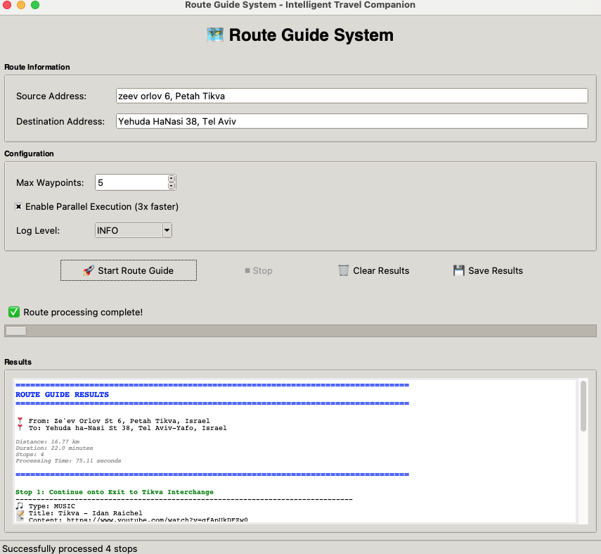
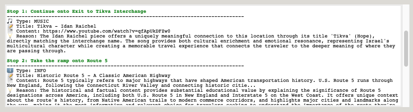

# Route Guide System

**Version 1.0.0**

An intelligent route enhancement system that transforms ordinary navigation into an enriched journey by providing contextual content (videos, music, historical information) for each significant location along your route.

## Overview

The Route Guide System is a multi-agent application that:
- Retrieves driving routes using Google Maps API
- Analyzes each significant junction/waypoint along the route
- Uses Claude AI to find relevant content for each location:
  - **Video Agent**: Finds relevant YouTube videos
  - **Music Agent**: Recommends contextually appropriate music
  - **Info Agent**: Provides historical facts and information
  - **Choice Agent**: Intelligently selects the most valuable content
- Returns structured JSON output with one recommendation per stop

## Features

- **Smart Waypoint Extraction**: Automatically identifies significant junctions and locations
- **Multi-Agent Architecture**: Three specialized agents (Video, Music, Info) plus intelligent Choice agent
- **⚡ Parallel Execution**: Agents run concurrently in separate threads for 3x performance improvement
- **Claude-Powered Recommendations**: Uses Claude CLI for contextual, intelligent content discovery
- **Configurable**: Flexible configuration via YAML and environment variables (including parallel execution toggle)
- **Thread-Safe**: Robust concurrent execution with proper error handling
- **Comprehensive Testing**: 70%+ test coverage including threading tests
- **Academic Quality**: Follows M.Sc. software engineering best practices

## Quick Start

**3 Simple Steps:**

1. **Setup** (one-time):
   ```bash
   cd /Users/eldadron/dev/agents-course/ex4
   source .venv/bin/activate  # Already created!
   ```

2. **Launch GUI**:
   ```bash
   python run_gui.py
   ```

3. **Enter your route and click "Start Route Guide"!** 🚀

## Project Structure

```
route-guide-system/
├── run_gui.py                 # GUI launcher (simple to use!)
├── src/
│   ├── gui.py                 # GUI application
│   └── main.py                # CLI entry point
├── docs/
│   ├── PRD.md                    # Product Requirements Document
│   └── ARCHITECTURE.md            # Architecture documentation
├── src/
│   ├── agents/                    # Agent implementations
│   │   ├── base_agent.py
│   │   ├── video_agent.py
│   │   ├── music_agent.py
│   │   ├── info_agent.py
│   │   └── choice_agent.py
│   ├── config/                    # Route service
│   │   └── route_service.py
│   ├── utils/                     # Utility modules
│   │   ├── config_loader.py
│   │   ├── logger.py
│   │   ├── validators.py
│   │   └── claude_client.py
│   ├── orchestrator.py            # Main orchestrator
│   └── main.py                    # CLI entry point
├── tests/                         # Unit tests
│   ├── test_agents.py
│   ├── test_validators.py
│   ├── test_config_loader.py
│   └── conftest.py
├── config/
│   └── config.yaml                # System configuration
├── notebooks/                     # Jupyter notebooks for analysis
├── results/                       # Output directory
├── .env.example                   # Environment variables template
├── requirements.txt               # Python dependencies
├── .gitignore
└── README.md
```

## Prerequisites

- **Python 3.8+**
- **Google Maps API Key** (with Directions API enabled)
- **Claude CLI** installed and authenticated
- Internet connection

## Installation

### 1. Clone or Download the Project

```bash
cd /path/to/route-guide-system
```

### 2. Create Virtual Environment

```bash
python -m venv venv

# Activate (macOS/Linux)
source venv/bin/activate

# Activate (Windows)
venv\Scripts\activate
```

### 3. Install Dependencies

```bash
pip install -r requirements.txt
```

### 4. Set Up Configuration

#### Create .env File

```bash
cp .env.example .env
```

Edit `.env` and add your Google Maps API key:

```env
GOOGLE_MAPS_API_KEY=your_actual_api_key_here
LOG_LEVEL=INFO
```

**Get Google Maps API Key:**
1. Go to [Google Cloud Console](https://console.cloud.google.com/)
2. Create a project
3. Enable "Directions API"
4. Create credentials (API Key)
5. Copy key to `.env`

#### Verify Configuration

The `config/config.yaml` file contains system settings. Default values should work for most users.

### 5. Install and Authenticate Claude CLI

```bash
# Install Claude CLI (if not already installed)
# Follow instructions at: https://claude.ai/cli

# Authenticate
claude auth login
```

Verify Claude is working:

```bash
claude --version
```

## Usage

### 🖥️ GUI Mode (Recommended for Beginners)

Launch the graphical interface:

```bash
# Activate virtual environment
source .venv/bin/activate

# Run GUI
python run_gui.py
```

The GUI provides:
- ✅ Easy input fields for source and destination
- ✅ Configuration options (waypoints, parallel execution, log level)
- ✅ Real-time progress indicator
- ✅ Beautiful results display
- ✅ Save results functionality
- ✅ No command-line knowledge needed!

**GUI Screenshots:**





**GUI Features:**
- **Source/Destination Entry**: Type or paste addresses
- **Max Waypoints**: Adjust from 1-50 using spinner
- **Parallel Execution**: Toggle for 3x speed boost
- **Log Level**: Choose DEBUG, INFO, WARNING, or ERROR
- **Progress Bar**: Visual feedback during processing
- **Results Display**: Formatted, color-coded output
- **Save Button**: Export results to JSON file

### 💻 Command-Line Mode (Advanced Users)

#### Basic Usage

```bash
python -m src.main --source "New York, NY" --destination "Boston, MA"
```

#### Advanced Usage

```bash
# Limit waypoints
python -m src.main -s "San Francisco, CA" -d "Los Angeles, CA" --max-waypoints 10

# Change log level
python -m src.main -s "Chicago, IL" -d "Detroit, MI" --log-level DEBUG

# Don't save to file
python -m src.main -s "Seattle, WA" -d "Portland, OR" --no-save
```

### Command-Line Options

```
Options:
  -s, --source TEXT           Source address (required)
  -d, --destination TEXT      Destination address (required)
  --max-waypoints INT         Maximum waypoints to process (default: 20)
  --config PATH               Path to custom config file
  --log-level LEVEL           Log level (DEBUG, INFO, WARNING, ERROR)
  --output PATH               Custom output file path
  --no-save                   Don't save output to file
  --version                   Show version
  -h, --help                  Show help message
```

## Output Format

The system generates JSON output with this structure:

```json
{
  "source": "New York, NY, USA",
  "destination": "Boston, MA, USA",
  "stops": [
    {
      "address": "I-95 Exit 15, Connecticut",
      "choice": {
        "type": "info",
        "title": "Historic Connecticut Turnpike",
        "content": "The Connecticut Turnpike, now I-95, was completed in 1958...",
        "reason": "Provides historical context about this major highway"
      }
    },
    {
      "address": "Providence, RI",
      "choice": {
        "type": "video",
        "title": "Walking Tour of Downtown Providence",
        "content": "https://www.youtube.com/watch?v=...",
        "reason": "Excellent visual introduction to this historic city"
      }
    }
  ],
  "metadata": {
    "total_waypoints": 15,
    "processed_stops": 12,
    "total_distance_km": 346.2,
    "estimated_duration_minutes": 225,
    "processing_time_seconds": 187.4,
    "timestamp": "2025-11-29T10:30:00"
  }
}
```

Output files are saved to `results/` directory with timestamped filenames.

## Running Tests

```bash
# Run all tests
pytest

# Run with coverage
pytest --cov=src --cov-report=html

# Run specific test file
pytest tests/test_agents.py

# Run with verbose output
pytest -v
```

View coverage report: Open `htmlcov/index.html` in a browser.

## Configuration

### Environment Variables (.env)

| Variable | Description | Required |
|----------|-------------|----------|
| `GOOGLE_MAPS_API_KEY` | Google Maps API key | Yes |
| `LOG_LEVEL` | Logging level (DEBUG, INFO, WARNING, ERROR) | No |
| `GOOGLE_MAPS_TIMEOUT` | API timeout in seconds | No |
| `CLAUDE_TIMEOUT` | Claude CLI timeout in seconds | No |

### System Configuration (config/config.yaml)

Key settings:

```yaml
# Performance settings
system:
  parallel_execution: true       # Enable parallel agent execution (recommended)
  max_agent_threads: 3          # Number of concurrent agent threads

route:
  max_waypoints: 20              # Maximum waypoints per route
  waypoint_extraction_strategy: "major_junctions"

agents:
  video:
    enabled: true
    weight: 1.0                  # Weight for choice agent
  music:
    enabled: true
    weight: 1.0
  info:
    enabled: true
    weight: 1.2                  # Prefer educational content

output:
  save_to_file: true
  output_dir: "results"
  format: "json"
```

**Parallel Execution:**
- Set `parallel_execution: true` for 3x faster processing (default)
- Set `parallel_execution: false` for debugging or if threading issues occur
- Agents run independently in separate threads when enabled

See `config/config.yaml` for all options.

## Troubleshooting

### Google Maps API Errors

**Error: API key not found**
- Ensure `.env` file exists and contains `GOOGLE_MAPS_API_KEY`
- Verify you copied `.env.example` to `.env`

**Error: This API project is not authorized**
- Enable "Directions API" in Google Cloud Console
- Check API key restrictions

**Error: Rate limit exceeded**
- Google Maps free tier: 40,000 requests/month
- Reduce `max_waypoints` or wait for quota reset

### Claude CLI Errors

**Error: Claude command not found**
- Install Claude CLI: Follow instructions at https://claude.ai/cli
- Verify with: `claude --version`

**Error: Not authenticated**
- Run: `claude auth login`
- Follow authentication prompts

**Timeout errors**
- Increase `CLAUDE_TIMEOUT` in `.env`
- Check internet connection
- Reduce `max_waypoints` to process fewer locations

### General Issues

**ModuleNotFoundError**
```bash
# Ensure virtual environment is activated
source venv/bin/activate

# Reinstall dependencies
pip install -r requirements.txt
```

**Permission denied writing to results/**
```bash
# Create directory manually
mkdir -p results
chmod 755 results
```

## Development

### Code Style

```bash
# Format code
black src/ tests/

# Lint code
pylint src/
flake8 src/
```

### Adding New Agents

1. Create new agent in `src/agents/`
2. Inherit from `BaseAgent`
3. Implement `_create_prompt()` and `_parse_response()`
4. Register in orchestrator
5. Add tests

Example:

```python
from .base_agent import BaseAgent, AgentResult

class MyAgent(BaseAgent):
    def __init__(self, claude_client, timeout=30):
        super().__init__(claude_client, "my_agent", timeout)

    def _create_prompt(self, address: str, context: dict) -> str:
        return f"Your prompt for {address}"

    def _parse_response(self, response: str, address: str) -> AgentResult:
        # Parse response and return AgentResult
        pass
```

## Documentation

- **PRD**: See `docs/PRD.md` for product requirements
- **Architecture**: See `docs/ARCHITECTURE.md` for system design
- **API Docs**: Code is fully documented with docstrings

## Performance

- **Parallel execution enabled** (default): ~10 seconds per waypoint
  - Video, Music, and Info agents run concurrently in threads
  - 3x faster than sequential execution
- **Sequential execution**: ~30 seconds per waypoint (if parallel disabled)
- **Typical processing time**:
  - 10 waypoints: ~2-3 minutes (parallel) vs ~5-6 minutes (sequential)
  - 20 waypoints: ~4-5 minutes (parallel) vs ~10-12 minutes (sequential)
- **Recommended waypoint limit**: 10-20 for responsive experience

## Limitations

- **Language**: English only (MVP)
- **Transportation mode**: Driving only
- **Connectivity**: Requires internet connection
- **Rate limits**: Subject to Google Maps and Claude API limits
- **Content accuracy**: Agent recommendations depend on Claude's knowledge

## Future Enhancements

Planned features (see `docs/ARCHITECTURE.md` for details):

- Parallel agent execution for improved performance
- Caching layer for repeated routes
- Web API for remote access
- Mobile application
- Multi-language support
- ML-based personalization
- Real-time navigation integration

## License

This project is developed as part of an M.Sc. Computer Science program.

## Contributing

This is an academic project. For issues or suggestions:

1. Check existing documentation
2. Review PRD and Architecture docs
3. Submit detailed issue reports

## Credits

- **Google Maps Platform**: Route and geocoding services
- **Claude AI**: Content discovery and recommendations via Claude CLI
- **Course**: M.Sc. Software Engineering Project

## Contact

For questions about this project, refer to the documentation in `docs/`.

---

**Version**: 1.0.0
**Last Updated**: 2025-11-29
**Status**: Production Ready
